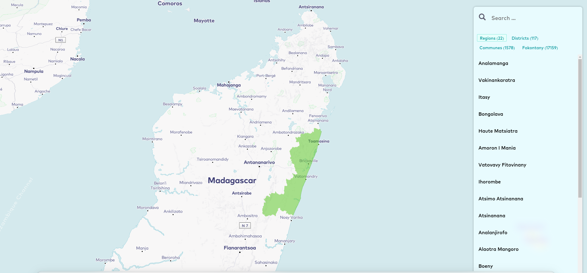

# Mada CLI

<p>
  <a href="https://github.com/tsirysndr/mada/releases/latest" target="_blank">
    
  </a>
 <a href="https://pkg.go.dev/github.com/tsirysndr/mada" target="_blank">
        
 </a>
  <a href="https://github.com/tsirysndr/mada/actions/workflows/release.yml" target="_blank">
    
  </a>
  <a href="LICENSE" target="_blank">
    
  </a>
</p>

Mada is a CLI that facilitates the search for regions, districts, communes and fokontany.


## 🚚 Installation

### macOS/Linux

```bash
# For Ubuntu
sudo apt install libsqlite3-mod-spatialite

# For Android (Termux)
pkg install libspatialite

brew install tsirysndr/tap/mada
```


### Docker

```bash
docker pull tsiry/mada:latest
```

### Compile from source

Without Docker, you need to install libspatialite before continuing

```bash
# For Ubuntu
sudo apt install libsqlite3-mod-spatialite

# For Android (Termux)
pkg install libspatialite
```

```bash
go install -v github.com/tsirysndr/mada@latest
```

### Nix

```bash
git clone https://github.com/tsirysndr/mada
cd mada
nix develop
go install
```

## 🚀 Usage

With Docker:

```bash
# execute mada init at first launch to initialize the database
docker run -v `pwd`/mada:"/root/.mada" -it tsiry/mada mada init
# Now you can search fokontany, commune, district or region
docker run -v `pwd`/mada:"/root/.mada" -it tsiry/mada mada search miaramasoandro
# Search location (encoded in Open Location Code)
docker run -v `pwd`/mada:"/root/.mada" -it tsiry/mada mada search "5HH94GJH+H7"
# Open Web UI in your browser (http://localhost:8010)
docker run -p 8010:8010 -v `pwd`/data:"/root/.mada" -it tsiry/mada
```



Without Docker:

```bash
# execute mada init at first launch to initialize the database
~> mada init
# Now you can search fokontany, commune, district or region
~> mada search miaramasoandro

4 matches, showing 1 through 4, took 237.941µs
    1. 14f4faf96bea4762d84c869c049ec219862e5d49f6fbbbb114007f96f47ec9a5 (4.626249)
        name
                Miaramasoandro
        fokontany
                Miaramasoandro
        country
                Madagascar
        district
                Faratsiho
        province
                Antananarivo
        region
                Vakinankaratra
        type
                fokontany
        commune
                Miandrarivo
    2. e4597e4987161de9fbe39c2b4a8f20734b547e8cf078365e38046ce86f682b3a (4.626249)
        name
                Miaramasoandro
        fokontany
                Miaramasoandro
        region
                Itasy
        type
                fokontany
        commune
                Tamponala
        country
                Madagascar
        district
                Soavinandriana
        province
                Antananarivo
    3. ca8efe0e1942ff0b097e1e5a210392f2f1c5f971d46c250fbb2cbd11d8417375 (4.626249)
        fokontany
                Miaramasoandro
        name
                Miaramasoandro
        commune
                Ambato
        country
                Madagascar
        district
                Ambohidratrimo
        province
                Antananarivo
        region
                Analamanga
        type
                fokontany
    4. 614df925b36deff00561292d26c9ac8de1c10511fbeceb60a619ebb89e627aaf (4.361670)
        fokontany
                Miaramasoandro
        name
                Miaramasoandro
        district
                Antsirabe I
        province
                Antananarivo
        region
                Vakinankaratra
        type
                fokontany
        commune
                Mahazoarivo Avarabohitra
        country
                Madagascar
# Search location (encoded in Open Location Code)
~> mada search "5HH94GJH+H7"
# Open Web UI in your browser (http://localhost:8010)
~> mada ui
```

If you want to use postgresql (with postgis extension) instead of sqlite (with spatialite), add the environment variable MADA_POSTGRES_URL, for example `export MADA_POSTGRES_URL=postgres://postgres@localhost:5432/mada?sslmode=disable`
